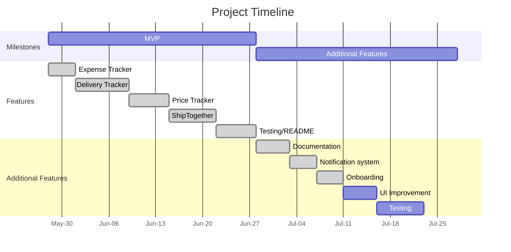

## README

## Table of Contents

* [README](#readme)
* [Table of Contents](#table-of-contents)
* [Note to Orbital Reviewers](#note-to-orbital-reviewers)
* [Features](#features)
  * [Expense Tracker](#expense-tracker)
  * [Delivery Tracker](#delivery-tracker)
  * [ShipTogether](#shiptogether)
* [Software Development Process](#software-development-process)
  * [Aim](#aim)
  * [Motivation](#motivation)
  * [User Story](#user-story)
  * [User flow](#user-flow)
  * [Design](#design)
  * [Implementation](#implementation)
  * [Problems we faced](#problems-we-faced)
* [Testing](#testing)
  * [System Testing](#system-testing)
  * [User Testing](#user-testing)
* [Project Timeline](#project-timeline)
* [Plan for Milestone 3](#plan-for-milestone-3)
* [Tech Stack](#tech-stack)
* [Project Log](#project-log)
  * [Yi Guan](#yi-guan)
  * [Zi Hao](#zi-hao)

## Note to Orbital Reviewers

ShopBud is **LIVE** at [https://shopbud.herokuapp.com/](https://shopbud.herokuapp.com)

Poster Link: [Link](https://drive.google.com/file/d/1VNAAU065_oKebyTNKvJZh6c0H6K-_scK/view?usp=sharing)

Watch our video demo at: [Link](https://drive.google.com/file/d/1utDdV6d5n3X6Ny-rnd638mxAVd-JS5X4/view?usp=sharing)

User Guide: [Link](https://github.com/tenebrius1/shopbud/wiki/ShopBud-User-Guide)

Developer Guide: [Link](https://github.com/tenebrius1/shopbud/wiki/ShopBud-Developer-Guide)

Github Link: [Link](https://github.com/tenebrius1/shopbud)

**NOTE**:

* Our webapp is currently **only optimized for desktop web browsers** though we have plans to include a mobile version in the future.
* You can leave comments simply by signing in and highlighting relevant parts of our README

## Features

### Expense Tracker

* Keeps track of spending on different platforms to assist in budget planning
* Add item: add various items bought to be included in the expense tracking
* Sort function to see spending based on platforms
* Sort items by prices
* Edit/Delete entries made
* Pie Chart for a overview of total spending, broken down into the different platforms for visual representation

### Delivery Tracker

* Consolidation of all orders that user have made and broad overview of all the delivery status
* Add item with a courier that is supported by our API to get status of order
  * _Do let us know of any other popular couriers that you would like us to support!_
  * _As of now, a popular courier that we are aware of that is not supported by the API we used is CJLogistics_
* Color coded delivery status makes it easy to know which stage of delivery your package is currently at
* Check time on when delivery status was last updated
* More detailed path taken by parcel can be enquired through API embedded in webpage

### ShipTogether

* Group buy/order feature, where users can form groups to order items from any online platform
* Create Group: Make a group by choosing what platform you want to buy from and adding shipping information (eg. price, availability of free shipping etc)
* Join Group: Search for group by name/location/platform to find suitable groups to join
* Leave/Delete Group: leave/delete a group
* Add/delete your own item to the group; not allowed to make changes to the item of others
* Shipping fee per member will be updated according to number of members in the group
* Lock Group: Once all orders are consolidated, group will be locked and owner proceeds to collect payment and make order
* Contact information of all group members made available to owner to ensure everyone pays; also for ease of communication between owner and group members
* Individual total amount payable will be made known to each member
* Owner checks off who has paid; other members can track progress of payments
* To ensure legitimacy of purchase, contact information must be given and proof of order must be submitted through upload of screenshot
* Add/Edit order details: Owner will send in relevant details about the order and set up a meeting time and place to distribute order _(Function only available for owner to edit)_
* Disqus forum implemented for group members to communicate/owner to send updates
* Report function to ensure a safe environment for all users

## Software Development Process

### Aim

We hope to integrate multiple online shopping assistants/apps(tracking of order, expense tracking, etc.) into one unified web app so that it is a one stop experience for our end users.

### Motivation

Shopping on E-commerce platforms has become really popular these days and we often tend to shop on multiple platforms such as Shopee, Lazada or ASOS. If we shop a lot, we can easily lose track of our total expenses or will not be able to keep track of all our shipments and delivery dates. We would have to check all platforms individually which could be a hassle! Not being able to track how much we are spending can also be dangerous, especially for poor uni students like us. We would also love to bring costs down when shopping, and this is where ordering together with other people comes in as costs can be lowered through buying in bulk or cheaper shipping.

### User Story

```gherkin=
Feature: Expense Tracker
  As a Shopper
  I want to be able to easily track my expense on different shopping platforms
  Because I want to know whether I am spending within my budget

  Scenario: User add expenses to track
    Given I'm a logged in User
    When I buy an item
    And I input relevant expense information
    Then my total spending should increase
    And a breakdown of my total expenses should be automatically
        generated and shown
```

```gherkin=
Feature: Delivery Tracker
  As a Shopper
  I want to be able to track my packages shipped using different couriers
  Because I want to see a unified view of my shippings in one place
          instead of tracking each one of them individually

  Scenario: User add deliveries to track
    Given I'm a logged*in User
    When I receive my tracking number
    And I input relevant tracking information
    Then the current delivery status should show
    And the status should be updated periodically
```

```gherkin=
Feature: ShipTogether
  As a Shopper
  I want to be able to find people who are buying from the same store as me
  Because I want to have the lowest shipping fee as possible

  Scenario: Owner creates group
    When the Owner creates a group
    Then the Owner waits for a Member to join his/her group

  Scenario: Member joins group
    When a Member finds a group that meet their requirements
    And the Member joins the group
    Then the Shipping fee per member of that group should decrease
    And the Amount to free shipping of that group should decrease (if applicable)

  Scenario: Owner locks the group
    Given I am owner of the group
    When I click on "Lock Group"
    Then I should be able to see all members contact details
    And I should be able to edit/input post-purchase details/information
```

### User flow


### Design

We took inspiration from various websites online and decided to use a template to model the design of our website. We eventually turned to AdminKit.io, with the cards template providing decent sectioning of content for our website. For the various charts on our website, we used [chart.js](https://www.chartjs.org/), a simple yet flexible JavaScript charting package.

### Implementation

We decided to use the [Django](https://www.djangoproject.com/) framework due to its versatility and powerful capabilities. Django is a Full-Stack web framework that takes care of many of the standard functionalities to build secure and maintainable websites. It also has several built-in templates and common features that can allow us to have a smooth development process. Django is written in Python, currently, one of the most popular programming language that can run anywhere.

### Problems we faced

We faced several challenges when building the whole webapp, forcing us to think critically to solve these problems. Below are some of the issues we faced:

1. Finding an API for our delivery tracker (RESOLVED)
   * There were several APIs available online such as EasyPost and Aftership. However, most of the free features available on these platforms are severely limited and may not have the common couriers that are provided in Singapore. Hence we have to research very intensively to find the most suitable API for our use case.
2. Webscraper for our price tracker (Failed :cry: )
   * We wanted to scrape the prices of products from several E-Commerce websites (Shopee, Lazada etc.) using Selenium. This solution was viable when we scraped our prices locally. We wanted to use the Heroku Scheduler to scrape the prices at a fixed time interval. However, when we ran our scraping function on Heroku, an issue arise, where we could not access the website or the content we want. _(Possibly due to E-Commerce Sites blocking access of headless browsers from Heroku)_
3. Flow of ShipTogether (RESOLVED)
   * We had to carefully plan the flow of how to implement group shipping, from the creation of each group to the delivery/collection of the goods ordered. We had to step into the shoes of the user and think of logical ways of what the user will want and how the user will want things to be.

## Testing

### System Testing

We conducted system testing to ensure that our product is working properly and that the pages/components are all rendering properly. We tested individual pages and wrote down all expected behaviors before we conducted our tests. We modeled our test cases in such a way that mirrors what a typical user can do with our webapp and what is the outcome the user should expect/see. Testing individual pages allows us to understand some of the issues that the users might face while using the applications and catch any bugs. We will also be able to see the changes made clearly when an input is given.

| S/N | Feature                  | Input                                          | Expected Behavior                                             | Result | Remarks                                 |
| --- | ------------------------ | :--------------------------------------------- | -------------------------------------------------------------- | ------ | --------------------------------------- |
| 1   | Landing Page             | -                                              | Renders Properly                                               | Pass   | -                                       |
| 2   | Register/Sign up         | All valid and correct fields                   | Login user                                                     | Pass   | -                                       |
| 3   | Register/Sign up         | Taken Email/username                           | Related error alert shown                                      | Pass   | -                                       |
| 4   | Register/Sign up         | Invalid Email(eg. missing @xxxxx.com)          | Related error alert shown                                      | Pass   | -                                       |
| 5   | Login                    | Registered user credentials                    | Successful Login                                               | Pass   | -                                       |
| 6   | Login                    | Invalid credentials                            | Error Alert                                                    | Pass   | -                                       |
| 7   | Reset Password           | Valid Credentials                              | Success message shown                                          | Pass   | -                                       |
| 8   | Reset Password           | Invalid Password                               | Error message shown                                            | Pass   | -                                       |
| 9   | Authentication           | No logined user                                | No access to any pages that requires login by manipulating url | Fail   | Some pages were accessible (Resolved)   |
| 10  | Dashboard                | -                                              | Renders all components                                         | Pass   | Empty for new users                     |
| 11  | NavBar                   | -                                              | Navigate to the different pages                                | Pass   | -                                       |
| 12  | Expense Tracker          | Add item with valid inputs                     | Successfully add item to table and update chart                | Pass   | -                                       |
| 13  | Expense Tracker          | Add item with invalid inputs                   | Error message shown                                            | Pass   | -                                       |
| 14  | Expense Tracker          | Edit item with valid inputs                    | Successfully update table and chart                            | Pass   | -                                       |
| 15  | Expense Tracker          | Delete Item                                    | Remove item from table and update chart                        | Pass   | -                                       |
| 16  | Expense Tracker          | Sort items according to respective headers     | Sort accordingly                                               | Pass   | -                                       |
| 17  | Delivery Tracker         | Add delivery with valid inputs                 | Successfully add order and update table                        | Pass   | -                                       |
| 18  | Delivery Tracker         | Add delivery with invalid inputs               | Error message shown                                            | Pass   |                                         |
| 19  | Delivery Tracker         | Invalid Tracking number                        | Status and time of delivery not shown                          | Pass   | Improvements can be made for this input |
| 20  | Delivery Tracker         | Delete item                                    | Remove item from table                                         | Pass   | -                                       |
| 21  | Delivery Tracker         | Sort items according to respective headers     | Sort accordingly                                               | Pass   | -                                       |
| 22  | Delivery Tracker         | Check tracking status with valid input         | Generate report successfully                                   | Pass   | -                                       |
| 23  | Delivery Tracker         | Check tracking status with invalid input       | Empty report                                                   | Pass   | -                                       |
| 24  | ShipTogether             | Create a group with valid inputs               | Successfully added group to table and my groups tab            | Pass   | -                                       |
| 25  | ShipTogether             | Create a group with invalid inputs             | Error messages shown                                           | Pass   | -                                       |
| 26  | ShipTogether             | Search item with valid inputs                  | Rows with matching text shown                                  | Pass   | -                                       |
| 27  | ShipTogether             | Search item not in table                       | No results                                                     | Pass   | -                                       |
| 28  | ShipTogether Group Page  | Delete/Leave Group                             | Group deleted and redirected to ShipTogether                   | Pass   | -                                       |
| 29  | ShipTogether Group Page  | Join Group                                     | Ability to add item added, Shipping fee per member updated     | Pass   | -                                       |
| 30  | ShipTogether Group Page  | Lock Group                                     | Redirect to locked group page                                  | Pass   | -                                       |
| 31  | ShipTogether Group Page  | Add Item with valid input                      | Successfully add item to table                                 | Pass   | -                                       |
| 32  | ShipTogether Group Page  | Add Item with invalid input                    | Error message shown                                            | Pass   | -                                       |
| 33  | ShipTogether Group Page  | Delete item                                    | Remove item from table successfully                            | Pass   | Only available to item owner            |
| 34  | ShipTogether Group Page  | Access valid product page                      | Redirect to Product page successfully                          | Pass   | -                                       |
| 35  | ShipTogether Group Page  | Sort items according to respective headers     | Sort accordingly                                               | Pass   | -                                       |
| 36  | ShipTogether Locked Page | Edit order details with valid input            | Successfully update table                                      | Pass   | Only available to group owner           |
| 37  | ShipTogether Locked Page | Edit order details with invalid input          | Error message shown                                            | Pass   | Only available to group owner           |
| 38  | ShipTogether Locked Page | Upload image                                   | Image shown                                                    | Pass   | Only available to group owner           |
| 39  | ShipTogether Locked Page | Edit Paid Status                               | Paid status changed for owner and members                      | Pass   | Only available to group owner           |
| 40  | ShipTogether Locked Page | Sort items according to respective headers     | Sort accordingly                                               | Pass   | -                                       |
| 41  | ShipTogether Pages       | Manipulate url to access locked/unlocked pages | Will be redirected to correct page according to locked status  | Fail   | Resolved                                |
| 42  | UI                       | Non-interactable components                    | Renders Successfully                                           | Pass   | -                                       |
| 42  | UI                       | Buttons                                        | Renders Successfully and works as intended                     | Pass   | -                                       |
| 43  | UI                       | External APIs                                  | Renders Successfully and works as intended                     | Pass   | -                                       |

Here are some minor issues we have encountered as well outside of our testing.

1. We had to refresh the page when items in our table were edited/deleted to get an updated page. (Resolved with the use of [AJAX](https://api.jquery.com/category/ajax/) request)
2. Upon leaving group, the data of user who left the group still shows (Resolved by doing several checks in the backend to ensure all user data is deleted properly)
3. Uploading of screenshots not available on Heroku (Resolved by storing and serving media files through [Cloudinary](https://cloudinary.com/))
4. Updating of user information status (Resolved by adding alerts to notify if there is and error or success when updating user information)
5. The Free tier of the [API](https://www.trackingmore.com/) we used for our Delivery Tracking only last for 7 days (Resolved (?) by simply creating [disposable email accounts](https://testmail.app/) every 7 days.)

### User Testing

As of milestone 2, no formal user testing has been done. Moving forward to milestone 3, we plan to conduct formal user testing with 10 users. We will come up with a list of scenarios for our users to follow. Each test would last around 20-30 minutes to allow some time for user to follow scenarios planned and fully understand/explore our product. A survey in the form of a Google Form will then be given to our users for them to give their feedback and to rate their satisfaction of our product. More updates will be given in milestone 3.

## Project Timeline



<!-- ## User Testing -->

## Plan for Milestone 3

* [ ] Perform user testing
* [ ] UI/UX Improvements
* [x] ~~Add additional features to further optimise product (Notification system etc.)~~
* [x] ~~Allow users to input any platform instead of having limited options for the expense tracker~~
* [x] ~~Onboarding of users using [shepherdjs](https://shepherdjs.dev/)~~

## Tech Stack

1. HTTPS-Secured with Let’s Encrypt CA (Heroku)
2. PostgreSQL database for storing various data
3. Python with Django framework for backend
4. HTML/CSS for frontend work of our webapp
5. Boostrap design system
6. Javascript/JQuery to send AJAX request for a smoother UX
7. Deployment on Heroku
8. Media cloud storage and server using Cloudinary

> Click [here](https://docs.google.com/document/d/1l4UlsGf9LmCwoKB5_YWZ3GzQotKH8sjJPMXLMt3Rzsw/edit?usp=sharing) for a detailed breakdown of all the libraries/dependencies that were used

## Project Log

### Yi Guan

|   Date   |                          Tasks                          | Duration (hours) | Remarks                                                                                                                   |
| :------: | :-----------------------------------------------------: | :--------------: | :------------------------------------------------------------------------------------------------------------------------ |
| 10/05/21 |               Poster and Video Discussion               |        4         | -                                                                                                                         |
| 12/05/21 |                      Video Making                       |        4         | -                                                                                                                         |
| 14/05/21 |                    Initial planning                     |        2         | -                                                                                                                         |
| 15/05/21 |                      Git Programme                      |        2         | -                                                                                                                         |
| 17/05/21 |              Revise Django, HTML, CSS, JS               |        5         | -                                                                                                                         |
| 19/05/21 |                 Progamming Landing Page                 |        6         | Set up skeleton for the design and look we wanted to go for with temporary filler text                                    |
| 22/05/21 |              Programming Signup/Login Page              |        4         | - Setting up and connecting Postgres Database on heroku to store user information<br>- Handle backend of login and signup |
| 24/05/21 |                   Work on Milestone 1                   |        5         | -                                                                                                                         |
| 25/05/21 |               Programming Dashboard Page                |        5         | Set up skeleton for the main dashboard page users will see after login                                                    |
| 27/05/21 |               Programming Dashboard Page                |        5         | Learnt basics of chart.js to include filler charts in prototype                                                           |
| 28/05/21 |                  Complete Milestone 1                   |        3         | -                                                                                                                         |
| 30/05/21 |               Programming Expense Tracker               |        5         | Connected front and back end using AJAX requests                                                                          |
| 01/06/21 |     Assisted with frontend work of Expense Tracker      |        3         | Dealt with the formatting of the various data                                                                             |
| 02/06/21 |            Searched and tried Tracking APIs             |        5         | -                                                                                                                         |
| 04/06/21 |      Integrated TrackingMore API into our project       |        6         | -                                                                                                                         |
| 05/06/21 |                Software Testing Workshop                |        2         | -                                                                                                                         |
| 07/06/21 |            Delivery Tracker Front + Backend             |        5         | -                                                                                                                         |
| 09/06/21 |           Learning Webscraping using Selenium           |        5         | -                                                                                                                         |
| 11/06/21 | Programming Webscraping logic for various online stores |        7         | -                                                                                                                         |
| 14/06/21 |       Attempted to run a scheduled task on heroku       |        4         | -                                                                                                                         |
| 16/06/21 |                  Planning ShipTogether                  |        3         | Come up with flow for feature                                                                                             |
| 18/06/21 |                  ShipTogether Features                  |        8         | Settle backend for the various pages                                                                                      |
| 21/06/21 |                     Project Meeting                     |        4         | Iron out details/minor changes                                                                                            |
| 22/06/21 |                     Project Meeting                     |        6         | README and begin testing                                                                                                  |
| 23/06/21 |                     Work on README                      |        3         | Completed User Stories                                                                                                    |
| 28/06/21 |                     Project Meeting                     |        6         | Finalize Milestone 2                                                                                                      |

### Zi Hao

|   Date   |              Tasks               | Duration (hours) | Remarks                                                                |
| :------: | :------------------------------: | :--------------: | ---------------------------------------------------------------------- |
| 10/05/21 |   Poster and Video Discussion    |        4         | -                                                                      |
| 12/05/21 |           Video Making           |        4         | -                                                                      |
| 14/05/21 |         Initial planning         |        2         | -                                                                      |
| 15/05/21 |         Mission Control          |        2         | Git Workshop                                                           |
| 17/05/21 |   Learn Django, HTML, CSS, JS    |        5         | -                                                                      |
| 19/05/21 |   Learn Django, HTML, CSS, JS    |        5         | -                                                                      |
| 21/05/21 |   Learn Django, HTML, CSS, JS    |        5         | -                                                                      |
| 24/05/21 |       Complete Milestone 1       |        5         | -                                                                      |
| 25/05/21 |    Programming Dashboard Page    |        5         | Set up skeleton for the main dashboard page users will see after login |
| 27/05/21 |    Programming Dashboard Page    |        5         | Learnt basic of chart.js to include filler charts in prototype         |
| 28/05/21 |       Complete Milestone 1       |        5         | -                                                                      |
| 30/05/21 |   Programming Expense Tracker    |        5         | Front-End work on Expense Tracker                                      |
| 01/06/21 |   Programming Expense Tracker    |        3         | Further Front-End work on Expense Tracker and formatting of data       |
| 02/06/21 | Searched and tried Tracking APIs |        3         | -                                                                      |
| 05/06/21 |         Mission Control          |        2         | Software Testing                                                       |
| 06/06/21 |     Completed Django Course      |        6         | -                                                                      |
| 07/06/21 |         Delivery Tracker         |        5         | Front and Back End work of delivery tracker                            |
| 09/06/21 |         Delivery Tracker         |        5         | Formatting of data and link with API                                   |
| 11/06/21 |          Price Tracker           |        7         | Learn Webscraping on selenium and assist with programming              |
| 14/06/21 |  Finding Selenium alternatives   |        4         | Test and try alternatives due to Selenium not working                  |
| 16/06/21 |      Planning ShipTogether       |        3         | Discuss and come up with a logical flow for the feature                |
| 17/06/21 |       ShipTogether feature       |        6         | Make and link the relevant pages for the feature                       |
| 18/06/21 |      ShipTogether Frontend       |        6         | Work on organization and frontend of the pages                         |
| 21/06/21 |         Project Meeting          |        4         | Iron out small details/minor fixes                                     |
| 22/06/21 |         Project Meeting          |        6         | README and begin testing                                               |
| 27/06/21 |          Documentation           |        6         | User Guide, testing and README                                         |
| 28/06/21 |         Project Meeting          |        6         | Finalize Milestone 2                                                   |

| Yi Guan | Zi Hao | Total |
| :------ | :----- | :---: |
| 117     | 122    |  239  |
